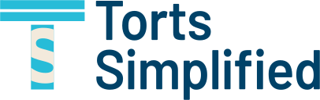

```{=html}
<section class="hero">
  <div class="motion"><div class="blob b1"></div><div class="blob b2"></div><div class="blob b3"></div><div class="veil"></div></div>
  <div class="wrap hero-in">
    <div class="hero-copy">
      
      <div class="eyebrow">Mass tort operations for law firms</div>
      <h1>The entire ecosystem your firm needs to establish a profitable, scalable mass tort practice.</h1>
      <p class="lead" style="max-width:58ch">Our turnkey, customized solution enables law firms to internally execute tort operations more efficiently and cost effectively by leveraging their existing systems and processes to increase profitability, drive better case quality, and reduce risk.</p>
      <p class="lead" style="max-width:58ch">Whether you are a firm looking to enter the mass tort sector or a firm currently in the market looking to increase competitive advantage, Torts Simplified will help you optimize your ROI.</p>
      <div class="tagline">We build &amp; manage it. You own it.</div>
    </div>
    <div class="portrait"></div>
  </div>
</section>

<div class="ctastrip">
  <div class="wrap pad">
    <a class="btn cta-big" href="services.html">Our Services</a>
  </div>
</div>

<section class="sec">
  <div class="wrap pad">
    <div class="head-rule">
      <div class="eyebrow">How we work</div>
      <h2 style="margin-top:22px">Assess. Build. Manage.</h2>
    </div>
    <div class="cards">
      <div class="card">
        <h3>Assessing your needs</h3>
        <p>We start with evaluating what you already have running: your systems, your processes, and where the operation is leaking value.</p>
      </div>
      <div class="card">
        <h3>Building the infrastructure for you</h3>
        <p>Vendors, intake flows, campaigns, validation, reporting. Custom built on top of the systems your firm already uses.</p>
      </div>
      <div class="card">
        <h3>Managing as much or as little as you like</h3>
        <p>Stay hands off and let us run it, or take the controls yourself. The infrastructure is yours either way.</p>
      </div>
    </div>
  </div>
</section>

<section class="deep">
  <div class="glow"></div>
  <div class="wrap pad inner">
    <div class="eyebrow">The Torts Simplified model</div>
    <h2>Own your infrastructure. Have complete visibility into case value, spending, and performance.</h2>
  </div>
</section>

<section class="sec">
  <div class="wrap pad founder">
    <div class="fimg"></div>
    <div>
      <div class="eyebrow">Leadership</div>
      <h2 style="margin-top:22px">Serge Zenin, Esq., Founder &amp; CEO</h2>
      <p class="lead" style="margin-top:24px">Torts Simplified is led by Serge Zenin, an expert in both building mass tort operations from scratch and optimizing and enhancing existing operations at every stage of the lifecycle.</p>
      <div class="roles">
        <div class="role"><span>Director of Mass Torts</span><em>Darrow AI</em></div>
        <div class="role"><span>VP of Operations</span><em>Pioneertown Media</em></div>
        <div class="role"><span>General Manager</span><em>Morgan &amp; Morgan, P.A.</em></div>
        <div class="role"><span>COO &amp; Co-founder</span><em>Justpoint</em></div>
      </div>
    </div>
  </div>
</section>
```
